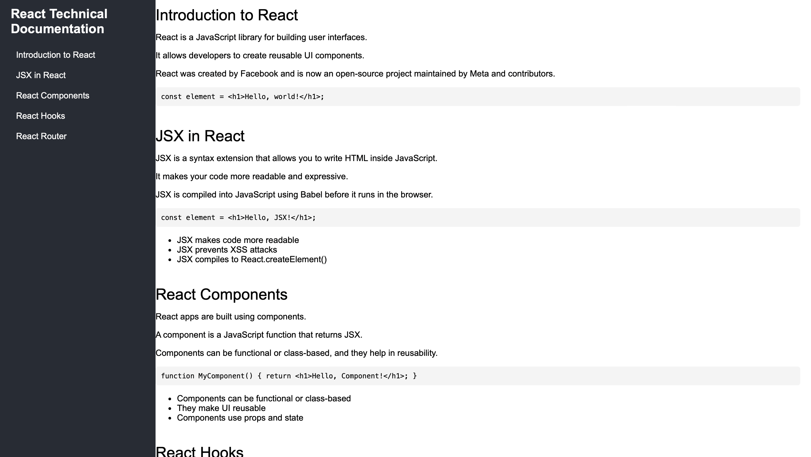

# TechDocPage
 Technical Documentation Page, certification project freeCodeCamp

# 📘 TechDocPage

> A responsive technical documentation page built for the freeCodeCamp certification project, demonstrating semantic HTML structure, navigable content, and accessibility best practices.

---

## 🌐 Live Site  
[View the Project on GitHub Pages](https://cfree87.github.io/tech-doc/)

---

## 🛠️ Built With  
- HTML5  
- CSS3  
- Git & GitHub  
- Flexbox  
- Responsive Design Principles  

---

## 📸 Screenshots  


---

## 📄 Features  
- ✅ Fixed navigation bar with scrollspy behavior  
- ✅ Semantic sectioning with clean HTML structure  
- ✅ Accessible keyboard navigation  
- ✅ Code snippets with inline examples  
- ✅ Fully responsive layout  

---

## 💡 Inspiration  
This project was developed as part of the Responsive Web Design Certification from [freeCodeCamp](https://www.freecodecamp.org). The goal was to demonstrate an understanding of how to structure and style a technical documentation page with user accessibility and responsive principles in mind.

---

## 🚀 How to Use  
1. Clone this repository:
   ```bash
   git clone https://github.com/cfree87/Tech-Doc.git
   ```

2. Open `index.html` in your browser  
   _or_  
   Use a local development server (like Live Server in VS Code)  

---

## ✍️ Author  
**Christopher Freeman**  
📧 [FWDbyChristopher@gmail.com](mailto:FWDbyChristopher@gmail.com)  
🔗 [LinkedIn Profile](https://www.linkedin.com/in/christopher-freeman-05497322a/)

---

## 📘 License  
This project is licensed under the MIT License - see the [LICENSE](LICENSE) file for details.